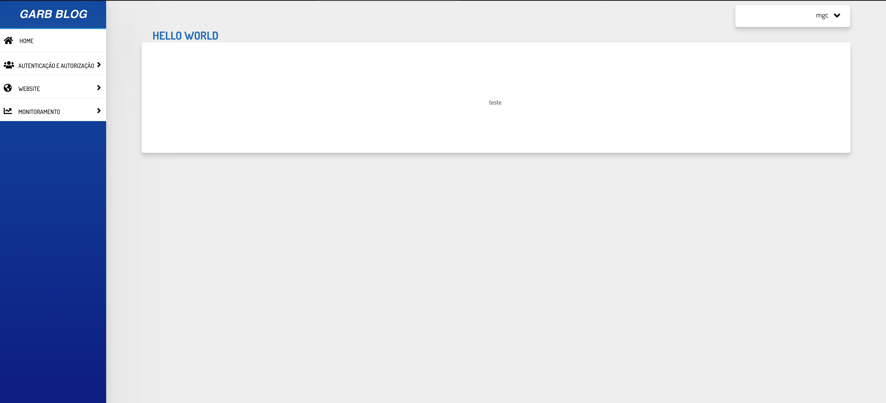
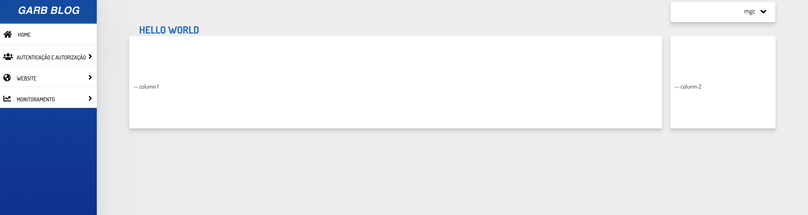
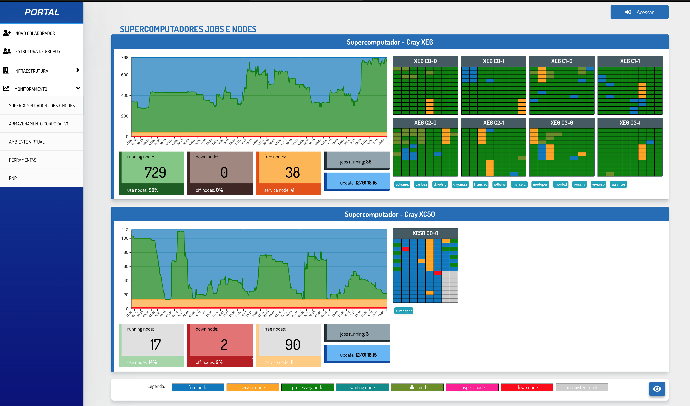
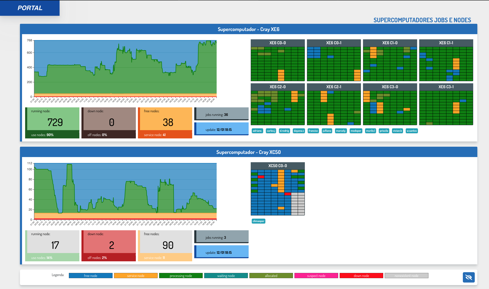
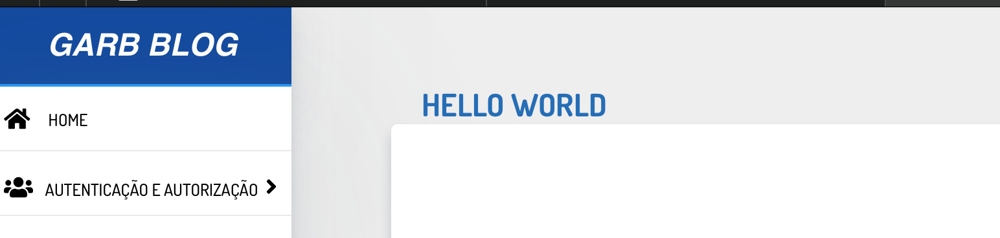

Facilities
=============

Grid templates
---------------

Grid template menu + 1 column.::

    
        

            -- column 1
        

    

Grid template menu + 2 columns.::

    
        

            

                

                    -- column 1
                

                

                    -- column 2
                

        

    

Turn off the menu
-----------------

Create template + button.::

    
        

            

            

            <button type="button" class="button float-right"  data-name="view_all">
                <i class="fa fa-eye fa-lg p-1"></i>
            </button>
        

    

Add Js::

    
        
    

Menu ON

Menu OFF

Set breadcrumbs
----------------

Add ViewContextMixin in view::

    from garb.views import ViewContextMixin

Use in class base view::

    class HelloView(ViewContextMixin, TemplateView):
        template_name = "hello_world.html"
        title = "hello world"

